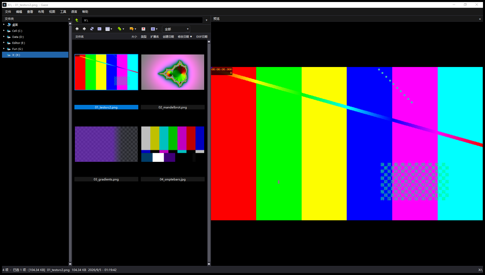
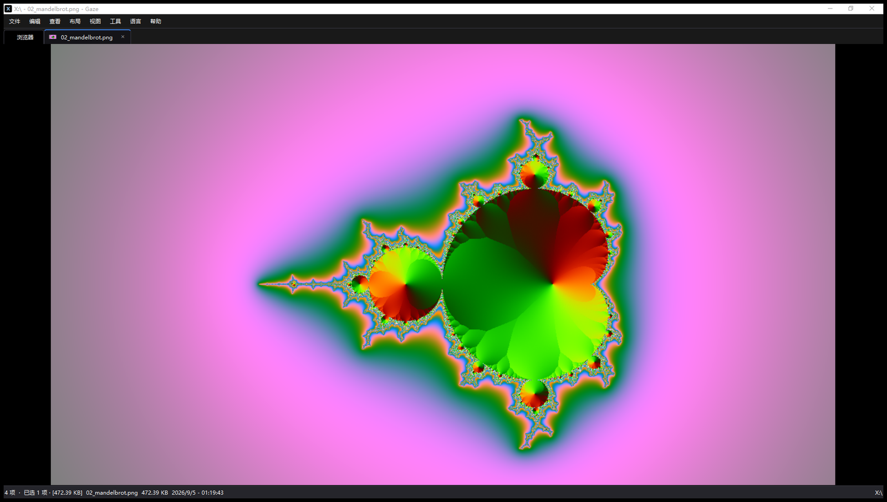

<div align="center">


# Gaze

**A local media viewer & file browser for Windows**

简体中文 | [English](./README.en-US.md)


🔥 A lightweight open-source alternative inspired by XnView MP, rebuilt on a modern stack (C++17 / Qt 6.8 LTS) — high performance, comfort-first UX, and broad format coverage.

</div>

> Inspired by **XnView MP** — this project aims to be its lightweight open-source counterpart, opening up more possibilities for users who want to customize their own image viewer.
> Kudos to the original author, **Pierre-e Gougelet**!

---

## ✨ Highlights

- **Format coverage first** — 33 image extensions + 26 RAW formats (LibRaw statically linked) + AVIF / HEIC / JPEG XL; 28 video containers including RMVB and MXF; all decoders ship with the app, zero system dependencies
- **Huge folders stay smooth** — virtualized custom-drawn file grid + background multi-threaded thumbnail engine + SQLite caching; six-digit file counts still scroll like butter
- **Photo viewing done right** — four-in-one folder thumbnails, 8 view modes (waterfall / detail sheet…), long-press 1:1 pixel peek, cursor-centered zooming
- **Motion handled too** — Motion Photos play on a single click, GIF frame-by-frame stepping, full-screen filmstrip gallery covering the whole folder
- **Organizing without the grind** — Ctrl+1~5 color labels, 18 filter modes, 16 sortable columns, text-to-image search (local CLIP + OCR, nothing leaves your machine)
- **For the detail-obsessed** — CMYK press-accurate rendering, lossless JPEG rotate/crop, audio waveform preview, built-in PDF, histogram & EXIF panel
- **Truly portable** — single folder, no registry writes; instant light/dark theme switching; fully translated (828 strings, EN/ZH)

---

## 📑 Features

<details>
<summary><b>Click to expand all features</b> (~250 items, full table in <a href="FEATURES.en-US.md">FEATURES.en-US.md</a>)</summary>

**🖼 Browser**
- ✅ Three-pane layout: folder tree / file grid / preview panel, each toggleable, layout fully remembered
- ✅ 8 view modes: thumbnails, thumbnails+filename, +labels, details, icons, list, details table, waterfall
- ✅ 4-in-1 folder thumbnails: folders aggregate 4 preview images, fetched at high resolution then downsampled
- ✅ Persistent multi-tabs with tab thumbnails; Ctrl+W close, Ctrl+Shift+T restore, middle-click/double-click close
- ✅ Virtualized owner-drawn file grid: smooth scrolling in 100k-file folders, fixed 7-column header
- ✅ Thumbnail engine: background multithreaded + SQLite cache, 384/768/custom sizes
- ✅ Inline search (Ctrl+F type-to-search) + folder search dialog (include/exclude regex)

**🔍 Sort · Filter · Labels**
- ✅ 16-column header sorting: name/size/type/extension/created/modified/EXIF dual dates/dimensions/ratio/print size…
- ✅ Natural sorting (1, 2, … 10, not 1, 10, 2)
- ✅ 18 filter modes: images/videos/audio/documents/executables/folders/custom extension sets
- ✅ Color labels Ctrl+1~5: stored in SQLite, kept across sessions
- ✅ Filename color editor (extension → background color)

**👁 Viewer**
- ✅ Enter to enter, ESC to return — tree and grid hide, image fills the pane
- ✅ 1:1 pixel view (long-press), cursor-centered zoom, navigator mini-map with draggable blue frame
- ✅ GIF frame stepping / back-scrubbing / loop rewind
- ✅ Motion Photo: click the preview to play, XMP/ftyp dual-protocol detection
- ✅ PDF (Ghostscript) and text preview (auto truncation, word-wrap toggle, MD rendering)
- ✅ Metadata panel + histogram + EXIF overview
- ✅ Multi-image print layouts

**🎬 Video & Audio**
- ✅ 28 containers: MP4/MKV/WebM/FLV/RMVB/MXF…
- ✅ AV1 (bundled libdav1d, faulty hardware decoders refused), H.264/H.265, VP9 10-bit HDR10
- ✅ Playback bar: click-to-seek, remaining-time toggle, volume readout, left-click play/pause
- ✅ Fullscreen filmstrip gallery: whole folder included, image/video/audio filter buttons
- ✅ Audio waveform preview: decoded on a background thread, never blocks browsing
- ✅ Delete/move/rename while playing automatically releases the file

**🗃 Format & codec support (charter: all formats)**
- ✅ 33 image extensions: JPEG/PNG/GIF/WebP/BMP/TGA/TIFF/SVG/ICO/DDS/EXR/QOI/JPEG 2000…
- ✅ Modern formats: AVIF, HEIF (HEIC/HIF via bundled FFmpeg), JPEG XL
- ✅ RAW: 26 vendor extensions, LibRaw 0.21.4 statically linked, "Load original RAW" button
- ✅ CMYK JPEG: unified print-intent rendering + color interpretation toggle
- ✅ All codec components ship with the program (FFmpeg/Ghostscript/jpegtran) — zero system extensions required

**📂 File management**
- ✅ Delete to Recycle Bin (folders & batches included), F3 open with default app, F2/double-click rename
- ✅ Lossless JPEG rotate/crop (jpegtran)
- ✅ Drag & drop between tree and grid with clear forbidden-target feedback
- ✅ Single instance: launching again raises the existing window

**⚙️ Settings & integration**
- ✅ 20 settings pages, ~166 setting keys
- ✅ Dark/light theme switching live (no restart)
- ✅ Bilingual UI (Chinese/English, 828 strings fully translated)
- ✅ Explorer context menu "Browse with Gaze", file association registration, ms-settings shortcuts
- ✅ Search images by text: local CLIP+OCR semantic retrieval service
- ✅ Folder size computation (accurate background recursion + cache DB)
- ✅ Database maintenance page, crash minidump + event log self-diagnostics

</details>

---

## 📸 Screenshots

| Browser · three-pane layout | Viewer · Enter to fill the pane |
|:---:|:---:|
|  |  |

*Dark theme · actual runtime on a standard test-image library; every UI element is rendered live by the program.*

---

## 🖼 Supported formats

| Category | Coverage |
|---|---|
| Images | 33 extensions: JPEG / PNG / GIF / WebP / BMP / TGA / TIFF / SVG / ICO / DDS / EXR / QOI / JPEG 2000 … |
| Modern | AVIF, HEIF, JPEG XL (JXL), animated WebP |
| Professional | RAW (26 vendor extensions, LibRaw statically linked), CMYK JPEG |
| Video | 28 containers (MP4/MKV/WebM/FLV/RMVB/MXF…), H.264/H.265/AV1 (bundled libdav1d), VP9 10-bit HDR10 |
| Audio | 10 extensions, waveform preview (decoded on a background thread, never blocking browsing) |
| Documents | PDF (Ghostscript), TXT/MD text preview |

---

## 🥣 Usage

### Portable (recommended)

Download `Gaze_1.0.0_Portable.zip` from [Releases](../../releases), extract anywhere, and run `Gaze.exe`.

- All settings are stored in `Gaze.ini` inside the program folder, with the thumbnail cache in `thumbnails.db`
- No registry writes (only optional first-run shell integration); migration is simply copying the folder

### Installer

Download `Gaze_1.0.0_Setup.exe` from [Releases](../../releases) and follow the wizard. On first launch you can choose to move the configuration to `%APPDATA%` (the program folder stays read-only and user config survives uninstall).

### Build from source

```
Dependencies: CMake ≥ 3.16, Qt 6.8.3 (win64_mingw), MinGW 13.1.0 (SEH)
External libraries: obtain ffmpeg / Ghostscript / jpegtran from official channels and place them where the build expects; LibRaw sits under thirdparty/
```

```bash
cmake -S . -B build -G "MinGW Makefiles" -DCMAKE_BUILD_TYPE=Release
cmake --build build -j
```

Icon assets are downloaded and rendered by `tools/fetch_mdi_icons.py` / `tools/fetch_lucide_icons.py` (run them before building to regenerate); the build script syncs resources into the build directory, so the output runs as-is.

---

## ⌨️ Keyboard shortcuts (selected)

| Key | Action |
|---|---|
| Enter / double-click | Enter the viewer (browser ↔ viewer toggle) |
| ESC | Return to the browser |
| G | Fullscreen preview (image only; layout restored exactly on exit) |
| F11 | Fullscreen window |
| Space | Default action / play-pause |
| Ctrl+F | Inline search |
| F2 / F3 | Rename / open with default app |
| Ctrl+W | Close the current tab |
| Ctrl+PgUp / PgDn | Switch tabs (progress seek on media pages) |
| Ctrl+1~5 | Color labels |
| B / F | Browse history back / forward |
| Home / End | First / last item |
| Long-press left button | 1:1 pixel view (cursor-focused) |

Full table in [FEATURES.en-US.md §11](FEATURES.en-US.md).

---

## 📜 Notes

- **Icon assets**: application icons come from [Material Design Icons](https://materialdesignicons.com/) and [Lucide](https://lucide.dev/) (both permissively licensed and redistributable), plus some hand-drawn ones; rendered by the scripts under `tools/`, regenerate before building
- **Build artifacts are not committed**: compiled output (`build_qt68/`) and third-party runtime libraries are not distributed with the repo; build from source as described above

---

## ♥️ Acknowledgements

- [Qt](https://www.qt.io/) — application framework
- [LibRaw](https://www.libraw.org/) — RAW decoding
- [FFmpeg](https://ffmpeg.org/) — audio/video decoding
- [Ghostscript](https://ghostscript.com/) — PDF rendering
- [jpegtran](https://jpegclub.org/) — lossless JPEG operations

---

## ⚠️ Disclaimer

This project is a personal-use tool intended for learning and exchange purposes only. Users are responsible for complying with the laws of their environment; the author bears no liability for any issues arising from the use of this software.

## 📄 License

Released under the [GPL-3.0](./LICENSE). Icon assets come from Material Design Icons and Lucide (permissively licensed, redistributable), plus some hand-drawn ones.
