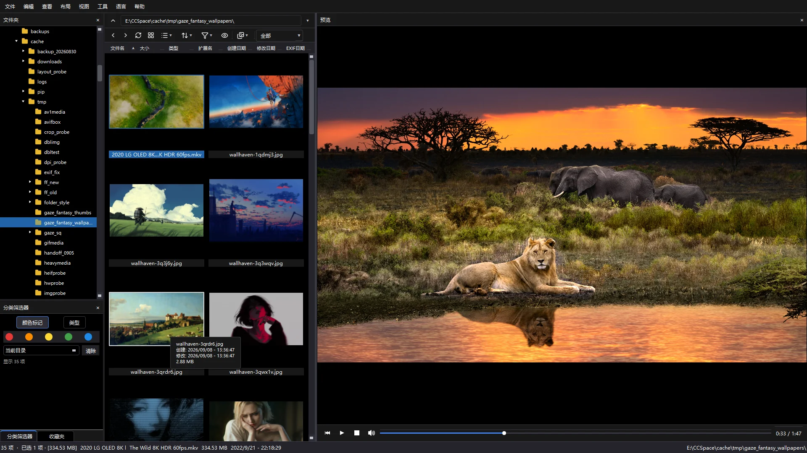
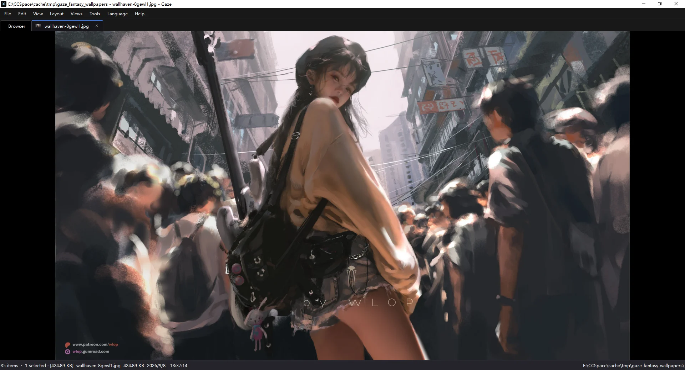
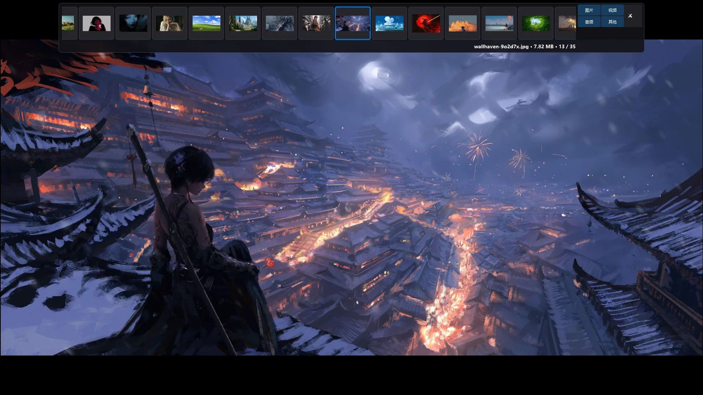
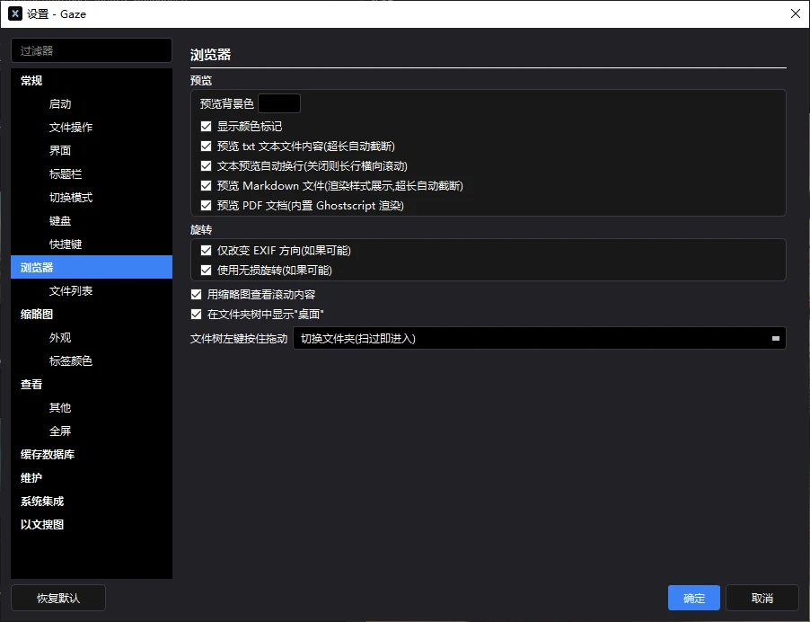
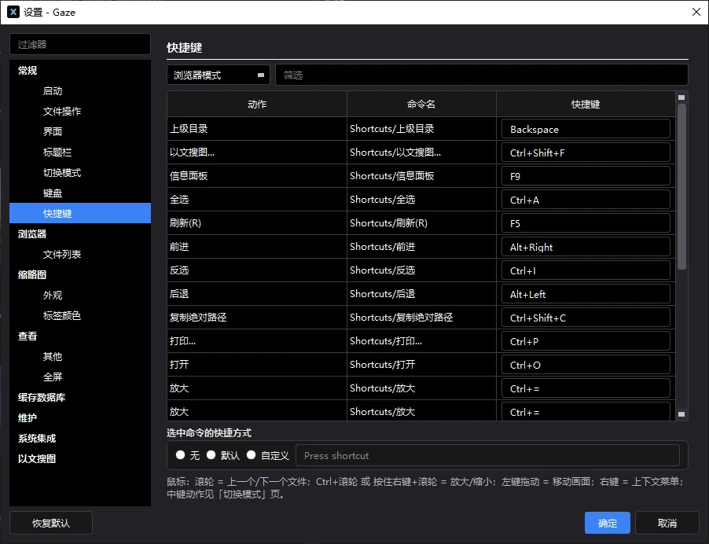

<div align="center">


# Gaze

**A local media viewer & file browser for Windows**

简体中文 | [English](./README.en-US.md)


### 🔥 One program that does the whole job: browser + viewer + player + manager

**Every format** (33 images · 26 RAW · 28 videos · 10 audio · PDF/TXT/MD) · **real-time 8K HDR10 playback** · **full-speed software-decoded AV1** · **Everything-powered instant search** · **local CLIP text-to-image search** · **buttery scrolling in 100k-file folders** · ~250 features · 166 setting keys

### **No media library to build — unpack and it just works. Manage files of every format.**

> Inspired by **XnView MP**, this project aims to be a lightweight alternative.
> Kudos to the original author, **Pierre-e Gougelet**!

</div>

---

## ✨ What Gaze does that others don't

| | Gaze | Typical alternatives |
|---|---|---|
| 📂 Media library | **Zero library**: open it and the whole disk is there — folders are what you see, no scanning wait | Build / import a library first, wait for indexing |
| 📦 Install | **Unpack and run**: no registry writes, migrate by copying the folder; installer also available | Installer + registry + config scattered around |
| 🧩 Codecs | **FFmpeg / Ghostscript / LibRaw / dav1d all bundled** — AVIF / HEIC / RAW / PDF open on a bare system | Requires system codecs or extensions |
| 🗂 Format handling | **Files of every format can be browsed and managed**; preview coverage listed separately | Images only — everything else invisible |
| 🔎 Disk-wide search | **Everything engine integration**: instant exact folder sizes, whole-disk file search in a blink | You get to browse one folder at a time |
| 🧠 Text-to-image | **Local CLIP+OCR semantic search**: find that picture with a sentence, data never leaves the machine | No such capability |
| 🎬 Video | Real-time 8K HDR10 / full-speed software AV1 / Motion Photos play on a single click | Often handed off to an external player |
| ⚡ Performance | **Extremely optimized thumbnail generation** (background multithreading + instant cache hits) · **instant, precise video seeking** | Waiting on thumbnails, scrubbing that drifts |
| 🖨 CMYK printing | **Color-managed CMYK JPEG decoding** + one-click print-intent toggle | Unsupported, or decoded with a color cast |

---

> From file switching and thumbnail generation to labeling, deletion and filtering — every path of the browse-and-preview experience is tuned to the limit.

## 📑 Features

<details>
<summary><b>Only a brief list of ~250 features here</b> — see <a href="FEATURES.en-US.md">FEATURES.en-US.md</a> for the full inventory</summary>

| | |
|---|---|
| 🖼 **Browsing & views** | Three-pane layout (tree / grid / preview; six pane types toggled & remembered) · 8 view modes · layout presets · persistent multi-tabs (thumbnail tabs, restorable) · back/forward auto-locates · address bar (history, file:/// support) · two-way tree sync · hidden items tinted · drag & drop move / copy · title templates · five startup modes · single instance |
| 🗂 **Thumbnails** | Background multithreaded generation, instant on cache hit · 4-in-1 folder thumbnails · three-tier decoding (Qt → Shell → ffmpeg fallback) · single-cover mode · configurable frame position · HDR tone-mapping · 48–1024px custom · SQLite cache & maintenance tools |
| 👁 **Viewer & preview** | Eight preview kinds (image / GIF / video / audio / TXT / MD / PDF / RAW) · 1:1 pixel view · cursor-centered zoom · navigator mini-map · Gamma / sharpen / HiDPI 1px=1px · three fullscreen layers (exact layout restore) · top gallery · Markdown rendering · PDF rendering · RAW background decode · EXIF tree + histogram · instant folder sizes · video flicker eliminated |
| 🎬 **Video & audio** | 28 containers · real-time 8K HDR10 · full-speed software AV1 · instant precise seeking · Motion Photos on one click · GIF bidirectional scrubbing · progressively drawn waveforms · configurable seek step · delete/move while playing without file locks |
| 🔎 **Search & sort** | Everything-powered instant disk search · local CLIP text-to-image search · 16 sort columns · natural sort · 10 startup presets · 18 filter modes · five color labels · Ctrl+F type-to-search · folder regex search (time-sliced, never freezes) |
| 📋 **File management** | ~25-item context menu · Recycle-Bin delete (folders & batches) · lossless JPEG rotate / flip / crop · lossless non-JPEG transforms · multi-image print layouts (15 persisted options) · EXIF auto-rotate · rename focus routing · recent files |
| 🗃 **Formats & decoding** | AVIF / JXL → ffmpeg (dav1d / libjxl) · HEIC → WIC · color-managed CMYK decoding + print-intent toggle · file-header sniffing · RAW whitelist (LibRaw statically linked) · every codec ships bundled |
| ⚙️ **Settings & integration** | Hundreds of setting keys · 20 pages · fully remappable shortcuts (visual editor) · dark / light themes · filename background editor · Explorer context-menu integration · file associations · portable / %APPDATA% migration |
| 🛡 **Stability & diagnostics** | GUI heartbeat watchdog · crash minidumps · startup checkpoints · full-level self-diagnostics logs |

</details>

---

## 📸 Screenshots

**Browser (three-pane layout · multi-format preview)**



**Viewer (multi-tab · multilingual UI)**



**Fullscreen preview (gallery on top)**



**Settings (hundreds of keys, down to every behavior)**



**Shortcuts (the genuinely handy kind)**



---

## 🖼 Previewable formats

> **Files of every format can be browsed and managed**; the table below lists the formats that support **preview** (images / playback / document rendering).

| Category | Coverage |
|---|---|
| Images | 33 extensions: JPEG / PNG / GIF / WebP / BMP / TGA / TIFF / SVG / ICO / DDS / EXR / QOI / JPEG 2000 … |
| Modern | AVIF, HEIF, JPEG XL (JXL), animated WebP |
| Professional | RAW (26 vendor extensions, LibRaw statically linked), CMYK JPEG |
| Video | 28 containers (MP4/MKV/WebM/FLV/RMVB/MXF…), H.264/H.265/AV1 (bundled libdav1d), VP9 10-bit HDR10 |
| Audio | 10 extensions, waveform preview (decoded on a background thread, never blocking browsing) |
| Documents | PDF (Ghostscript), TXT/MD text preview |

---

## 🥣 Usage

### Portable (recommended)

Download `Gaze_1.2.0_Portable.zip` from [Releases](../../releases), extract anywhere, and run `Gaze.exe`.

- All settings are stored in `Gaze.ini` inside the program folder, with the thumbnail cache in `thumbnails.db`
- **No import, no media library**: what you see is the folder — it's a browser the moment it opens
- No registry writes (only optional first-run shell integration); migration is simply copying the folder

### Installer

Download `Gaze_1.2.0_Setup.exe` from [Releases](../../releases) and follow the wizard. On first launch you can choose to move the configuration to `%APPDATA%` (the program folder stays read-only and user config survives uninstall).

### Build from source

```
Dependencies: CMake ≥ 3.16, Qt 6.8.3 (win64_mingw), MinGW 13.1.0 (SEH)
External libraries: obtain ffmpeg / Ghostscript / jpegtran from official channels and place them where the build expects; LibRaw sits under thirdparty/
```

```bash
cmake -S . -B build -G "MinGW Makefiles" -DCMAKE_BUILD_TYPE=Release
cmake --build build -j
```

Icon assets are downloaded and rendered by `tools/fetch_mdi_icons.py` / `tools/fetch_lucide_icons.py` (run them before building to regenerate); the build script syncs resources into the build directory, so the output runs as-is.

---

## ⌨️ Keyboard shortcuts (selected)

| Key | Action |
|---|---|
| C / V | Previous / next file |
| Space | Play / pause |
| F | Color label |
| D | Clear label |
| Ctrl+1~5 | Pick one of five labels |
| X | New folder |
| S | Delete to Recycle Bin |
| Right-drag + wheel | Seek the progress bar |
| Long-press left button | Zoom at cursor |
| Ctrl+Wheel | Zoom the picture |
| Enter / double-click | Enter the viewer |
| ESC | Return to the browser |
| G | Fullscreen preview (exact layout restore) |
| F11 | Fullscreen window |
| Ctrl+F | Inline search |
| Ctrl+W | Close current tab |
| Ctrl+PgUp / PgDn | Switch tabs |

Full table in [FEATURES.en-US.md §11](FEATURES.en-US.md).

---

## 📜 Notes

- **Icon assets**: application icons come from [Material Design Icons](https://materialdesignicons.com/) and [Lucide](https://lucide.dev/) (both permissively licensed and redistributable), plus some hand-drawn ones; rendered by the scripts under `tools/`, regenerate before building
- **Build artifacts are not committed**: compiled output (`build_qt68/`) and third-party runtime libraries are not distributed with the repo; build from source as described above

---

## ♥️ Acknowledgements

- [Qt](https://www.qt.io/) — application framework
- [LibRaw](https://www.libraw.org/) — RAW decoding
- [FFmpeg](https://ffmpeg.org/) — audio/video decoding
- [Ghostscript](https://ghostscript.com/) — PDF rendering
- [jpegtran](https://jpegclub.org/) — lossless JPEG operations
- [XnView MP](https://www.xnview.com/en/xnviewmp/) — the design reference for the UI form and interactions

---

## ⚠️ Disclaimer

This project is a personal-use tool intended for learning and exchange purposes only. Users are responsible for complying with the laws of their environment; the author bears no liability for any issues arising from the use of this software.

## 📄 License

Released under the [GPL-3.0](./LICENSE). Icon assets come from Material Design Icons and Lucide (permissively licensed, redistributable), plus some hand-drawn ones.
